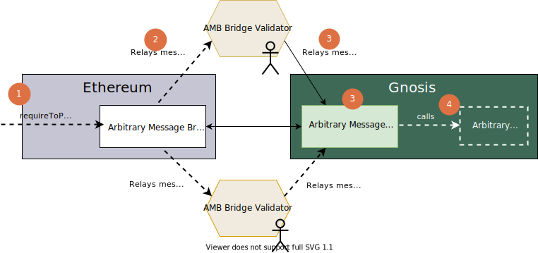

# Bridges Overview

Bridges are first-class citizens in Gnosis' architecture, given that the [native gas token](../about/overview.md) is created by bridging Dai from Ethereum. 

Gnosis has two main types of bridges: 

- [3rd-party Bridges](../user-guide/bridges.md#3rd-party-bridges)
- Native Bridges

This documentation covers the Native Bridges, with the [3rd-party Bridges](../user-guide/bridges.md#3rd-party-bridges) covered in the [User Guide](../user-guide/overview.md).

## Conceptual Architecture

Gnosis' native bridges use the [Tokenbridge Architecture](https://docs.tokenbridge.net/) that consists of smart contracts on both chains, and a group of trusted bridge validators that observe and confirm bridge transactions.

Gnosis has a [long-term roadmap](./roadmap.md) to move towards trustless bridges, and is actively funding research and development in this area.

## Bridging Dai (native asset)

:::info

The xDai bridge can be found at [bridge.gnosischain.com](https://bridge.gnosischain.com/)

:::

Gnosis has a special [native Dai bridge from Ethereum](./tokenbridge/dai.md) to mint xDai, a stablecoin that is used as gas for transaction fees in Gnosis. 

 

Once Dai is bridged into the [xDai bridge on Ethereum](./tokenbridge/dai.md), the xDai bridge contract on Gnosis mints and sends xDai to the user's corresponding address on Gnosis. This is done through the  [block rewards contract](./tokenbridge/dai.md#block-rewards-contract) as xDai is the native gas token of Gnosis. 

This process relies on a trusted group of [xDai Bridge Validators](./tokenbridge/dai#xdai-bridge-validators), who are known Gnosis community members, to perform the role of a bridge oracle. Gnosis' roadmap is to move towards [trustless bridges](./roadmap.md) using  [zero-knowledge proofs from light clients](./roadmap.md#zk-light-clients) or other trust-minimized techniques. 

The xDai bridge currently generates [bridge revenue](./tokenbridge/dai#bridge-revenue) through earned yield on stablecoins deposited on the bridge, which is then used by the [GnosisDAO treasury](../about/treasury.md) to fund Gnosis development. 

## Bridging Data

You can also send arbitrary data between Gnosis and Ethereum using the native [Arbitrary Message Bridge](./tokenbridge/data.md) (AMB). This allows Gnosis contracts to trigger contract functions on Ethereum, and vice-versa. 

The [Arbitrary Message Bridge](./tokenbridge/data.md) is part of the [Tokenbridge Architecture](https://tokenbridge.net/) and can be extended to relay data to any EVM-based chain. The AMB is a key bridge primitive that is used inside higher-order bridges like the [native token bridge](./tokenbridge/tokens.md). 

In addition to Ethereum, Gnosis supports data bridging to Binance Smart Chain.  There may be additional EVM-based networks supported in the future.  

Similar to the Dai bridge, the bridge process relies on a trusted group of [AMB Bridge Validators](./tokenbridge/data.md), who are known Gnosis  community members. The [long-term roadmap](./roadmap.md) is to move towards [trustless bridges](./roadmap.md#trustless-bridges) using [zero-knowledge proofs from light clients](./roadmap.md#zero-knowledge-light-clients) or other trust-minimized techniques.

## Bridging Tokens

:::info

Omnibridge can be accessed at [omni.gnosischain.com](https://omni.gnosischain.com/)

:::

For sending tokens to and from Gnosis, the network is supported by an ecosystem of [third-party bridges](../user-guide/bridges.md#third-party) as well as [Omnibridge](./tokenbridge/tokens.md) a native token bridge built on top of the Arbitrary Message Bridge. 

[Omnibridge](./tokenbridge/tokens) is based on the [Tokenbridge Architecture](https://docs.tokenbridge.net/), where tokens from the origin chain are bridged and equivalent representations are minted as  [ERC-677](./tokenbridge/tokens.md#erc-677) tokens on Gnosis. A canonical [Bridged Token Registry](./tokenbridge/tokens.md#bridged-token-registries) is maintained for each bridged chain. In addition to Ethereum, Omnibridge also supports Binance Smart Chain. 

As the Omnibridge is built on top of the Arbitrary Message Bridge, it relies on the same group of [Trusted Bridge Validators](./tokenbridge/data.md#bridge-validators). 

The Omnibridge currently generates [bridge revenue](./tokenbridge/tokens.md#bridge-revenue) through earned yield on stablecoins deposited on the bridge, which is then used by the [GnosisDAO treasury](../about/treasury.md) to fund Gnosis development. 

## Bridging NFTs

Gnosis does not support the native bridging of NFTs, and has since deprecated the [legacy native NFT bridge](https://docs.tokenbridge.net/eth-xdai-amb-bridge/nft-omnibridge-extension). 

Gnosis is supported unofficially by several  [3rd-party NFT Bridges](../user-guide/bridges.md#nft-bridges), most notably the [XP NFT Bridge](https://bridge.xp.network/)